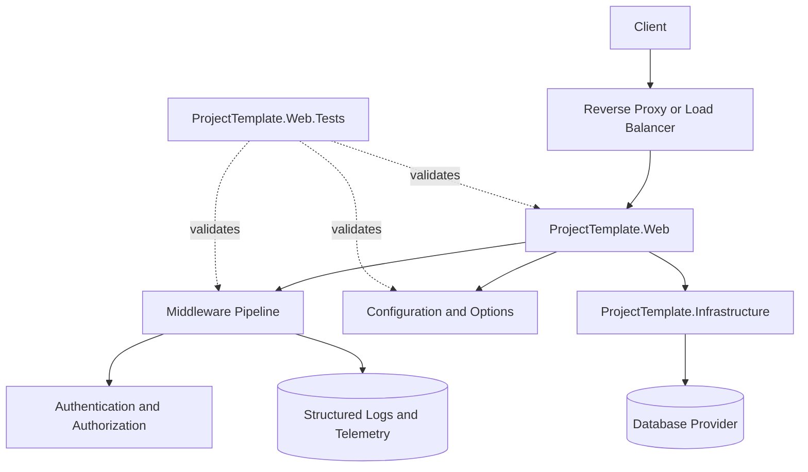

# Project Structure

The .NET Core Application Template is organized as a compact, production-oriented ASP.NET Core baseline. The repository separates runtime code, tests, documentation, packaging assets, scripts, and repository metadata so future applications have a clear starting structure.

## Repository Layout

```text
/
├── src/
│   ├── ProjectTemplate.Web/
│   │   └── ASP.NET Core host, startup composition, middleware, authentication, UI, API, health checks, and web-facing configuration
│   │
│   └── ProjectTemplate.Infrastructure/
│       └── Infrastructure, EF Core data access, persistence normalization, migrations, auditing, and provider-specific implementation details
│
├── tests/
│   └── ProjectTemplate.Web.Tests/
│       └── Automated tests for startup, configuration, middleware, authentication, authorization, data access, error handling, and runtime behavior
│
├── docs/
│   ├── adr/
│   │   └── Architecture decision records
│   ├── articles/
│   │   └── DocFX conceptual documentation
│   ├── examples/
│   │   └── Safe configuration examples
│   ├── images/
│   │   └── Documentation and README images
│   └── docfx.json
│
├── eng/
│   ├── Assert-SecurityCriticalCoverage.ps1
│   ├── security-critical-coverage.json
│   ├── scaffold-manifest.default.json
│   ├── scaffold-manifest.schema.json
│   └── Validate-ScaffoldManifest.ps1
│
├── scripts/
│   ├── migration.sql
│   └── Validate-VersionConsistency.ps1
│
├── .template.config/
│   └── dotnet new template metadata
│
├── .template.content/
│   └── consumer scaffold overlay content, including generated README and configuration replacements
│
├── .github/
│   ├── workflows/
│   │   └── GitHub Actions CI, documentation, package, container, CodeQL, and release validation workflows
│   ├── ISSUE_TEMPLATE/
│   │   └── Issue templates
│   ├── CODEOWNERS
│   ├── dependabot.yml
│   └── pull_request_template.md
│
├── .dockerignore
├── .editorconfig
├── .env.example
├── .gitattributes
├── .gitignore
├── ASSETS-LICENSES.md
├── CHANGELOG.md
├── CITATION.cff
├── CODE_OF_CONDUCT.md
├── CONTRIBUTING.md
├── Directory.Build.props
├── Directory.Packages.props
├── Dockerfile
├── docker-compose.yml
├── global.json
├── LICENSE.txt
├── NetCoreApplicationTemplate.slnx
├── NetCoreApplicationTemplate.Template.csproj
├── PACKAGE-README.md
├── README.md
├── RELEASE.md
└── SECURITY.md
```


## Solution Projects

| Project | Responsibility |
|:---|:---|
| `ProjectTemplate.Web` | ASP.NET Core host, startup composition, middleware pipeline, authentication and authorization registration, endpoint mapping, Razor Pages, MVC controllers, health checks, request logging, error handling, and web-facing configuration. |
| `ProjectTemplate.Infrastructure` | Infrastructure and persistence concerns that should not live directly in the web host, including EF Core data access and related implementation details. |
| `ProjectTemplate.Web.Tests` | Automated validation for template behavior, startup configuration, options binding, middleware registration, authentication and authorization behavior, and related web application concerns. |

The template intentionally starts with a small project structure. A generated application can add separate `Application`, `Domain`, or additional infrastructure projects later if its business complexity requires them.

## Runtime Architecture

The application is composed through `Program.cs` and extension methods that group related startup behavior. This keeps the host readable while making each infrastructure concern independently discoverable.



The most important architectural idea is that cross-cutting concerns are configured explicitly and consistently:

- Forwarded headers are handled early so downstream logging, redirects, and security behavior see corrected request information.
- Request logging is registered near the front of the pipeline so important request context is captured.
- Centralized error handling and Problem Details provide consistent failure behavior.
- Security headers, HTTPS redirection, static files, routing, CORS, rate limiting, authentication, authorization, and endpoint mapping are ordered intentionally.
- Data access is registered through configuration-driven provider selection rather than hard-coded runtime assumptions.

See also:

- [Middleware Pipeline](middleware.md)
- [Configuration](configuration.md)
- [Forwarded Headers](forwarded-headers.md)
- [Security Headers](security-headers.md)
- [Rate Limiting](rate-limiting.md)
- [Error Handling](error-handling.md)
- [Authentication](authentication.md)
- [Authorization](authorization.md)
- [Data Access](data-access.md)

## Startup Composition

`Program.cs` is intentionally short. It creates the web application builder, registers template services through focused extension methods, builds the application, configures the middleware pipeline, maps endpoints, and runs the host.

Common startup groups include:

- Serilog bootstrap and application logging.
- MVC controllers and Razor Pages.
- Health checks.
- Forwarded headers.
- Security headers.
- Rate limiting.
- Request logging.
- OpenTelemetry.
- Problem Details.
- Authentication and authorization.
- Data access.

This convention makes startup behavior easy to scan without forcing every detail into `Program.cs`.

## Extension Method Conventions

The template uses extension methods to group related behavior by concern.

Recommended conventions:

- Use `AddApplication...` methods for service registration on `IServiceCollection` or `WebApplicationBuilder`.
- Use `UseApplication...` methods for middleware added to the HTTP request pipeline.
- Use `MapApplication...` methods for endpoint mapping.
- Keep extension methods close to the feature area they configure.
- Keep ordering-sensitive middleware inside a central pipeline extension.

This pattern keeps each concern modular while preserving one authoritative pipeline ordering.

## Layering and Dependency Direction

The current solution keeps the dependency direction simple:

```text
ProjectTemplate.Web
        |
        v
ProjectTemplate.Infrastructure
```

`ProjectTemplate.Web` is the composition root. It owns startup, HTTP behavior, UI/API concerns, authentication integration, authorization policies, and endpoint mapping.

`ProjectTemplate.Infrastructure` contains implementation details that support the web host, especially persistence concerns. Web can reference Infrastructure because the host composes the application. Infrastructure should avoid depending on Web.

As applications grow, teams may introduce additional layers such as:

- `ProjectTemplate.Application` for use cases, commands, queries, and application services.
- `ProjectTemplate.Domain` for domain entities, value objects, and domain rules.
- Additional infrastructure projects for external services, messaging, or provider-specific implementations.

Those layers should be added when they solve a real complexity problem, not merely to satisfy a pattern.

## Configuration and Environment Boundaries

Application-owned settings are grouped under the template configuration section and bound through options where practical. Shared defaults live in `appsettings.json`, while environment-specific files, user secrets, environment variables, and deployment configuration can override values for a specific environment.

Typical examples:

- Development may use SQLite, local user secrets, verbose logging, and relaxed local-only settings.
- Production should use managed configuration, durable database providers, conservative logging levels, strict security headers, and explicit reverse proxy configuration.
- CI should use predictable configuration that supports repeatable restore, build, test, formatting, coverage, and documentation validation.

Environment-specific behavior should be controlled through configuration and options validation rather than conditional logic spread throughout the application.

See [Configuration](configuration.md) for the full configuration strategy.

## Middleware Boundary Model

The middleware pipeline acts as the runtime boundary of the application. It determines how requests are corrected, observed, limited, authenticated, authorized, handled, and mapped.

The template keeps this order centralized through the application pipeline extension so future changes can be reviewed in one place.

For more detail, see [Middleware Pipeline](middleware.md).

## Data Access Boundary

Data access is isolated behind the infrastructure project and configured through the web host. The default development path favors SQLite for local simplicity, while SQL Server support can be selected through configuration for production-oriented scenarios.

The template avoids applying production migrations automatically at startup. Migration creation, review, and deployment should remain an explicit operational step.

For more detail, see [Data Access](data-access.md).

## Testing Structure

The test project validates the template's expected runtime behavior. Tests should be added when changes affect:

- Startup registration.
- Options binding and validation.
- Middleware ordering or behavior.
- Authentication and authorization behavior.
- Data access provider selection.
- Error handling and response behavior.
- Security-sensitive defaults.

The goal is not only to test individual methods, but to protect the template's baseline expectations as it evolves.

## Documentation and Repository Metadata

The repository includes documentation and governance files because the template is intended to be reused, cited, reviewed, and eventually packaged.

Important repository-level files include:

- `README.md` for project overview, quick start, and public-facing orientation.
- `docs/` for detailed DocFX documentation.
- `docs/adr/` for architecture decision records.
- `CITATION.cff` for citation metadata.
- `CHANGELOG.md` for source-controlled release history.
- `SECURITY.md` for responsible disclosure guidance.
- `CONTRIBUTING.md` for contribution and pull request expectations.
- `.github/` for workflows and issue / pull request templates.

These files are part of the template's release-readiness foundation, not separate from it.
